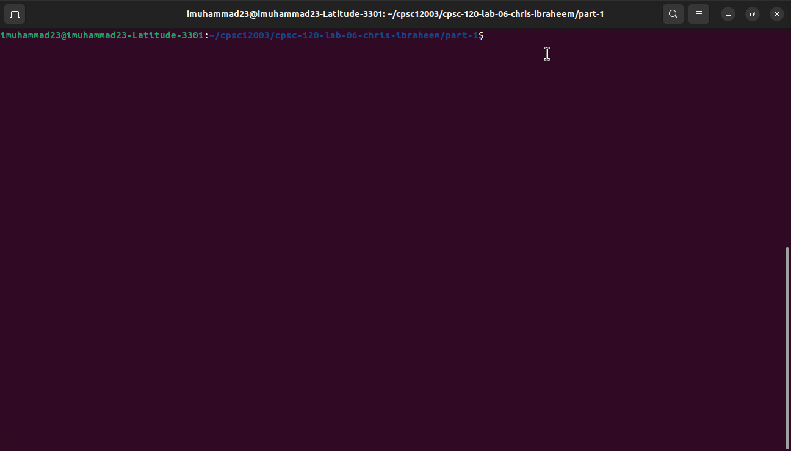
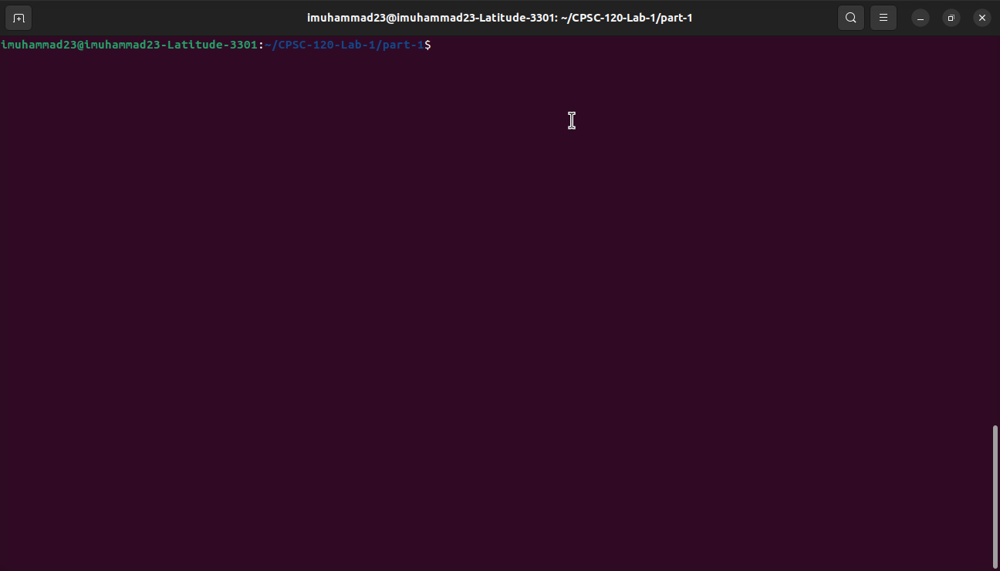
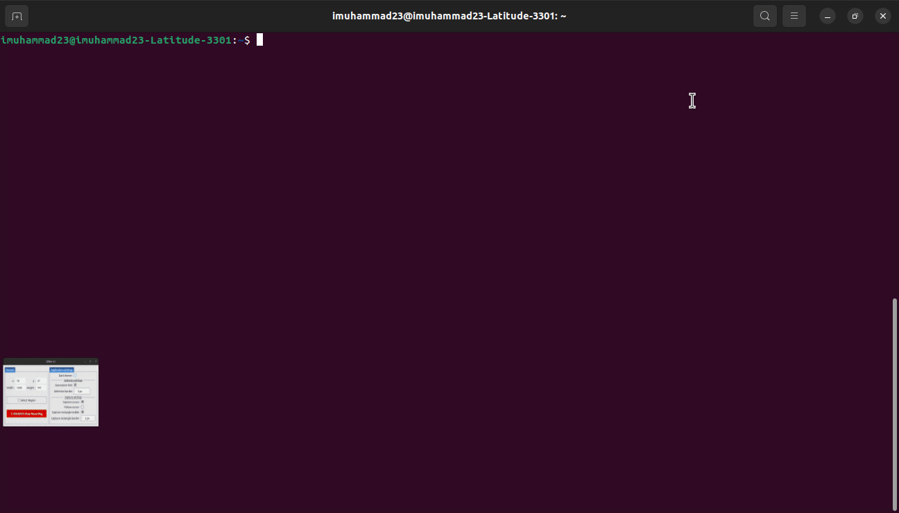

# Introduction

  

    Hello, This is my Lab Portfolio's Home Page. I am Ibraheem Muhammad, a Computer Science Major at <a href="https://www.fullerton.edu/">California State University Fullerton</a> 🐘.
  

  

    
  

# GitHub Username

This is my GitHub Page: [https://github.com/imuhammad23csuf](https://github.com/imuhammad23csuf)

# Favorite CPSC 120 Labs 

* [Lab 6 Part-1](https://github.com/imuhammad23csuf/CPSC-120-Lab6.git)
  

    
  

  I used factors like meat, loaf, and condiments and mastered creating a sandwich program. Using these factors made it engaging. I learned how to use loops and if statements effectively.
* [Lab 1 Part-1](https://github.com/imuhammad23csuf/CPSC-120-Lab-1.git)
  
  

    
  

  I used std::cout to print my name in the terminal. It helped me understand the standard library better. I also learned how to include a library using the #include function.

* [Lab 11 Part-1](https://github.com/imuhammad23csuf/CPSC-120-Lab11.git)
  
  

    
  

  I defined the pizza calorie count calculation using size and toppings. The lab was very engaging upon applying these factors. It helped me understand object-oriented programming and its applications better.
<!-- This is separated from the rest of the code -->

